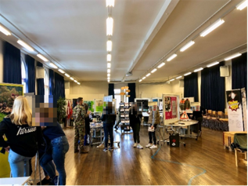

+++
title = "Sollten gleiche Rechte auch gleiche Pflichten bedeuten?"
date = "2022-12-02"
draft = false
pinned = false
image = "bild1.jpg"
+++


*Wer ins Militär geht, kann sich auf eine herausfordernde Zeit gefasst machen. Dabei erwartet Männer und Frauen dasselbe mit dem Unterschied, dass Frauen den Dienst freiwillig machen. Wir führen ein Gespräch zum Thema Militärpflicht mit Oberleutnant Fabienne Walser und nehmen an einem Orientierungstag exklusiv für Frauen teil, der uns den Militärdienst schmackhaft macht.*


Es ist ein Samstagmorgen, als wir uns am Bahnhof Bern treffen, um gemeinsam bis zur Haltestelle Guisanplatz Expo zu fahren. Wir halten beide ein ‘Aufgebot’ als Gratisbillett in der Hand, das wir nach der Anmeldung per Post erhalten haben. Damit dürfen wir heute den ganzen Tag den ÖV im Kanton Bern benutzen. Wir sind nämlich auf dem Weg zu einem Orientierungstag der Schweizer Armee, der exklusiv für Frauen ist. Aufgeregt steigen wir in das Tram und lesen noch einmal das Programm für den Tag durch. Beim Guisanplatz angekommen, müssen wir noch eine kurze Strecke zu Fuss gehen und schon stehen wir vor dem Amt für Bevölkerungsschutz, Sport und Militär Bern. Das Tor steht weit offen und wir betreten das Areal. Zielstrebig laufen wir auf die Mannschaftskaserne zu, vor der ein paar uniformierte Personen stehen. Sie zeigen uns den Weg in das Gebäude, wo uns eine Frau erwartet und schon das Anmeldeformular für die Rekrutierung und andere Broschüren austeilt. Mit Informationsmaterial ausgerüstet, begeben wir uns in einen Raum, in dem die anderen Teilnehmerinnen bereits ihren Platz gefunden haben und gespannt auf die Einführung warten. Kaum haben wir uns gesetzt, beginnt schon der Anlass. Zuerst wird eine Vorstellungsrunde gemacht und danach bekommen wir die verschiedenen Einheiten und Funktionen der Armee vorgestellt.

### Anpassungsfähigkeit ist wichtig

Kurz vor der Pause geht die Tür des Raumes auf und eine Frau in Uniform kommt herein. Diese stellt sich als Fabienne Walser, Oberleutnant im Bereich Sanität, vor. Sie ist direkt nach einem einwöchigen Wiederholungskurs an diesen Anlass gekommen und scheint in der vergangenen Nacht reichlich wenig Schlaf bekommen zu haben. Für die Pause ist draussen schon ein «Znüni»-Buffet vorbereitet worden. Währenddem wir ein «Gipfeli» essen, lesen wir die vielen Flyer durch, in denen junge Frauen abgebildet sind und von ihrer Zeit im Militär berichten. Am Anlass wird oft betont, dass im Militär alle gleichbehandelt werden. Auch Fabienne Walser bestätigt uns später, dass, wenn man sich anpassen könne, die Regeln befolge und das bringe, was verlangt werde, niemand bevorzugt oder vernachlässigt werde. Es sei nicht korrekt, jemanden, egal welche Hautfarbe oder Geschlecht, anders zu behandeln. Man könne nicht mal anhand der Kleider unterschieden werden, weil alle in der gleichen Uniform sind.


Frau Fabienne Walser ist seit Langem Teil der Schweizer Armee. Ihre Karriere im Militär begann, als sie nach ihrer Aushebung als Sanitätssoldatin während 18 Wochen die Rekrutenschule in Airolo (TI) besuchte. Danach war sie in eine Unteroffizierschule, ebenfalls für 18 Wochen, und hat den Grad «Wachtmeister» abverdient. Für eine Weile ist sie in das zivile Leben zurückgekehrt und hat während dieser Zeit zwei Wiederholungskurse (WK) absolviert. Daraus hat sie sich einen Vorschlag für einen Offizierslehrgang geholt und ist 15 Wochen in eine Offiziersschule gegangen. In einer Spitalkompanie in Moudon (VD) hat sie darauf den Grad Leutnant abverdient. Heute führt Fabienne Walser im Grad eines Oberleutnants eine Spitalkompanie.



### Ausbildungen und Neues ausprobieren

Was motiviert Frauen freiwillig den Militärdienst zu machen? Schliesslich verpflichten sie sich dazu, eine 18-wöchige Grundausbildung zu absolvieren. Während dieser Zeit können sie nur an den Wochenenden nach Hause gehen. Danach müssen sie jährlich Wiederholungskurse von je 19 Tagen besuchen oder sie entscheiden sich für das Durchdienermodell. Bei Letzterem absolvieren sie ihre gesamte Dienstzeit bei der Armee - das sind 300 Tage - am Stück.

Wir haben festgestellt, dass die Motive dafür, den Militärdienst zu leisten, sehr unterschiedlich sind. Manche der jungen Frauen, die den Orientierungstag besuchen, sagen, sie hätten schon seit Langem gewusst, dass sie einmal in die Rekrutenschule gehen wollen. Andere sind noch unentschieden und sind gekommen, um mehr über die Rekrutierung zu erfahren. Einige erklären auch, dass sie einen Ausgleich zu ihrem Leben suchen und etwas Neues ausprobieren möchten, um aus ihrer Komfortzone zu kommen. Frauen können auch ihre Fähigkeiten in gewissen Bereichen stärken, erzählt Fabienne Walser. Ausserdem sei es für sie im zivilen Leben etwas wert, im Militär gewesen zu sein, weil sie Diplome mitnehmen konnte, die anerkannt werden.

### Alle müssen die gleiche Leistung erbringen

«Ich musste zeigen, dass ich das Gleiche kann; genauso schwer tragen, viel laufen, viel essen, wenig schlafen wie sie *(die männlichen Kollegen).*» Das antwortet Fabienne Walser auf die Frage, ob sie sich schnell in das Kollektiv habe integrieren können. Sie sagt, sie habe sich in den ersten zwei Wochen noch den Männern beweisen müssen. Nach zwei Wochen hätten sie gemerkt, dass sie dieselbe Leistung erbringe, sie akzeptiert und ihr geholfen. Hätte sie immer gejammert, hätte sie nicht den Anschluss gefunden. Sie wäre nur ein Störfaktor gewesen, und das, obwohl sie sich freiwillig angemeldet hatte.

> «Ich musste zeigen, dass ich das Gleiche kann: genauso schwer tragen, viel laufen, viel essen, wenig schlafen wie sie.»
>
> \- Oberleutnant Fabienne Walser

Damit es nicht zu Fällen von Überbelastung und gar Abbruch des Dienstes kommt, müssen alle Rekruten einen Sporttest absolvieren. Je nachdem, welche Punktzahl sie dabei erreichen, werden sie für gewisse Funktionen bei der Armee zugelassen. Die Bewertung funktioniert für alle gleich, auch zwischen Frauen und Männern wird nicht unterschieden, denn am Ende müssen alle dieselbe Leistung erbringen. Alle müssen die gleiche Ausrüstung tragen und dieselben Aufgaben erfüllen.


Heutzutage haben Frauen in der Schweiz Zugang zu allen militärischen Funktionen. Anders als für Männer ist es für sie nicht Pflicht, einen Militär- oder Zivildienst zu leisten. Die Einführung einer solchen Pflicht für alle Schweizer*innen steht nicht selten zur Debatte. Ebenfalls wird diskutiert, ob der Orientierungstag auch für Frauen und nicht nur für Männer obligatorisch sein sollte. An einem Orientierungstag haben die zukünftigen Rekruten die Möglichkeit, sich über die Rekrutierung, den Zivilschutz, den Militär-, Zivil- und Rotkreuzdienst zu informieren.  

Der Militärdienst bleibt für Frauen vorerst freiwillig, doch die Schweizer Armee hat sich trotzdem zum Ziel gesetzt, den Frauenanteil bis 2030 auf 10% zu erhöhen. Seit Januar 2022 gibt es die Fachstelle Frauen in der Armee und Diversität (FiAD), welche das Ziel hat, die Diversität und Inklusion in der Schweizer Armee zu fördern.

Zurzeit beträgt der Frauenanteil knapp 1%, was im Vergleich zu vergangenen Jahren eine hohe Zahl ist. Schliesslich war das Jahr 2021 ein Rekordjahr, weil sich 57% mehr Frauen zur Rekrutierung meldeten als im Jahr zuvor.



> «Wir wollen Gleichberechtigung beim Job, Lohn, Kaderstellen, Steuern, die gleichen Rechte haben.»
>
> \- Oberleutnant Fabienne Walser

### Zwischen Freiwilligkeit und Obligation

Nun haben wir bereits einen guten Einblick in das bekommen, was einen nach einer Anmeldung für die Rekrutierung erwarten könnte. Uns wurden der Sporttest, das Auswahlverfahren, die Rekrutenschule und jegliche Wiederholungskurse vorgestellt. Wie der Rekrutierungsprozess für die Frauen genau funktioniert, erklärt uns Oberst i Gst (Oberst im Generalstab) Martin Gafner, Kommandant des Rekrutierungszentrums Sumiswald (BE). Dieser Prozess ist für Frauen und Männer unterschiedlich. Wenn Männer sich für die Rekrutierung angemeldet haben, sind sie schon dazu verpflichtet, den Dienst zu leisten. Frauen hingegen verpflichten sich erst, nachdem sie an der Aushebung gewesen sind (Einteilung eines zukünftigen Rekruten in eine Funktion) und den Vertrag unterschrieben haben. Der Rekrutierungsprozess ist unterschiedlich, weil Frauen sich freiwillig dafür entscheiden und Männer entweder den Militär- oder Zivildienst leisten und sonst Ersatzzahlungen entrichten müssen. Ebenfalls ist die Teilnahme an einem Orientierungstag für volljährige Männer obligatorisch, während sie für Frauen freiwillig ist. Fabienne Walser würde es begrüssen, wenn wenigstens der Orientierungstag für Männer und Frauen obligatorisch wäre. «Viele nehmen diesen Orientierungstag gar nicht wahr und werfen den Zettel mit der Einladung direkt ins Altpapier», sagt sie. Sie sei auch nicht anders gewesen. Mit 18 habe sie den Brief aufgemacht und sich gedacht, wenn sie nicht aufgrund ihres Vaters – er ist Berufsmilitär – so nahe mit dem Militär aufgewachsen wäre, hätte sie nur den Titel gelesen und den Brief weggeworfen. Man höre auch viele Schauermärchen, weil jeder erzähle, dass seine Rekrutenschule die Schlimmste gewesen sei. Dabei werde immer noch etwas zu der Geschichte dazu gedichtet. Ihrer Meinung nach sei es am besten, wenn man die Chance wahrnehme und sich ein eigenes Bild mache. Ausserdem wäre es korrekt, wenn es für alle eine Wehrpflicht gäbe. Sie erklärt: «Eine Frau kann auch einen Beitrag leisten und wenn nicht, muss sie auch nicht die anderen Ansprüche von Gerechtigkeit verlangen. Es ist wie eine Waage. Ich verlange etwas und gebe etwas zurück.» Sie fügt an, Frauen wollen beim Job, Lohn, Kaderstellen und Steuern Gleichberechtigung. Sie sollten auch bei der Militärpflicht gleichberechtigt sein und damit ihrem Land etwas zurückgeben.

> «Eine Frau kann auch einen Beitrag leisten und wenn nicht, muss sie auch nicht die anderen Ansprüche von Gerechtigkeit verlangen.»
>
> \- Oberleutnant Fabienne Walser

### Nach dem Essen wird Sport gemacht

Ungefähr um 12 Uhr begibt sich unsere Gruppe in ein anderes Gebäude, in dem schon das Mittagessen auf uns wartet. Es gibt Salat, Pasta und ein Dessert. Das Znüni und Mittagessen wurden von einem Armeekoch zubereitet und wir können sagen: Wenn das Essen der Rekrutenschule genauso gut schmeckt wie an diesem Tag, kann sich auf jeden Fall keiner darüber beklagen.

Gestärkt gehen wir nun zurück in einen Raum, wo schon ein «Marktplatz» vorbereitet ist. Er besteht aus einer Materialausstellung und informativen Postern zu den Einheiten der Armee wie auch den Anforderungsprofilen der Funktionen. An einem der Stände können wir sogar verschiedene militärische Ausrüstungsgegenstände anprobieren. Zum Schluss dürfen wir den Sporttest machen, der bestimmt, für welche Funktion jemand zugelassen wird. Zu diesem Test gehören der Standweitsprung, Medizinballstoss, Einbeinstand, Rumpfkrafttest und progressive Ausdauerlauf. Dadurch bekommen wir eine Kostprobe davon, welche körperlichen Anstrengungen der Militärdienst mit sich bringt, denn bei einem Grossteil der Disziplinen werden wir nur als knapp genügend eingeteilt. Falls wir uns dazu entscheiden, ins Militär zu gehen, werden wir wohl keine Militärpolizistinnen oder Grenadiere. Das sind nämlich diejenigen Funktionen, welche die höchsten Leistungen erfordern.

Im Grossen und Ganzen war der heutige Tag ein Erfolg. Wir haben viel über das Militärleben einer Frau gelernt, haben einen Einblick in die verschiedenen Gattungen der Armee bekommen und haben erfahren, wie der Rekrutierungsprozess abläuft. Wenn wir uns für die Rekrutierung anmelden wollen, haben wir alle Informationen, die wir benötigen. Wir haben sogar das Anmeldeformular, welches uns schon zu Beginn des Orientierungstages gegeben wurde. Somit sind wir bestens vorbereitet. Ausserdem könnten wir uns – was vorher nicht der Fall war – vorstellen, in die Armee zu gehen. Der Orientierungstag hat somit seinen Zweck erfüllt.